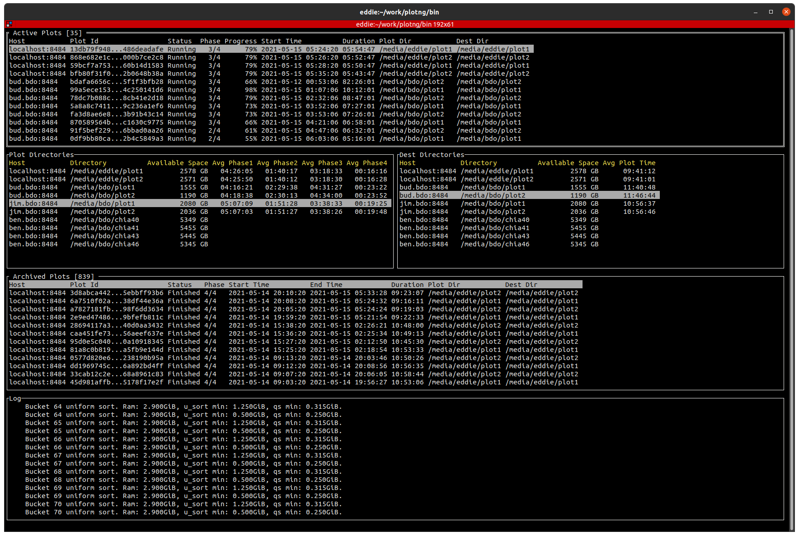

# PlotNG - plotting utility for Chia.Net

This utility consisted of server backend and UI which manages the chia plot creation.  
It uses the chia command line interface to start the plot.  
It will schedule new plots when a plot finishes as specified by the configuration file.
The server backend does a cycle every minute and check if the configuration file has been changed, if it detects that it has been changed then it reloads the configuration file.
Once a valid configuration file has been loaded then it will start one new plot per cycle.

**Donation: XCH**  `xch1wzvlj0ncv9uhjzcz43clkk0r84t6p2vp8k3yg762pglx6ufycmrsqnxj4v`

## Installation

Please download the latest [release](../../releases) 
Pre-built binaries available for 64-bits Linux, Windows and MacOS (I've only tested Linux version, although other users confirmed it is working on Windows and MacOS)

## Advance Installation from Source Code

    go get github.com/maded2/plotng
    cd plotng
    go install plotng/cmd/plotng

## Running Server (runs on the plotter)

`
plotng -config <json config file> -port <plotter port number, default: 8484>
`

**Please note**: chia enviornment should be activated before starting plotng

## Running Monitoring UI (run anywhere)

The UI can run on any host and point back to the server using the host and port parameter

`
plotng -ui -host <comma separated list of plotters host name or IP with/without port number>

eg. plotng -ui -host plotter1:8484,plotter2,plotter3:8485
`

## Configuration File (JSON format)

    {
        "Fingerprint": "",
        "FarmerPublicKey": "",
        "PoolPublicKey": "",
        "Threads": 0,
        "Buffers": 0,
        "NumberOfParallelPlots": 1,
        "TempDirectory": ["/media/eddie/tmp1", "/media/eddie/tmp2", "/media/eddie/tmp3"],
        "TargetDirectory": ["/media/eddie/target1", "/media/eddie/target2"],
        "StaggeringDelay": 5,
        "ShowPlotLog": false,
        "DiskSpaceCheck": false,
        "DelaysBetweenPlot": 0,
        "MaxActivePlotPerTarget": 0,
        "DisableBitField": false,
        "MaxActivePlotPerTemp": 0,
        "MaxActivePlotPerPhase1": 0,
        "UseTargetForTmp2": false,
        "BucketSize": 0,
        "SavePlotLogDir": ""
    }

Please note for Windows, please use capital drive letter and '/'  eg.  "D:/temp"

### Settings

- Fingerprint : fingerprint passed to the chia command line tool (you can either use the fingerprint if the private has been installed on the plotter or use the following farmer/pool public key instead)
- FarmerPublicKey : Farmer Public Key passed to the chia command line tool
- PoolPublicKey : Pool Public Key passed to the chia command line tool
- Threads : number of threads use by the chia command line tool.  If the value is zero or missing then chia will use the default
- Buffers : number of buffers use by the chia command line tool.  If the value is zero or missing then chia will use the default
- DisableBitField : With BitField your plotting almost always gets faster. Set true if your CPU designed before 2010.
- NumberOfParallelPlots : number of parallel plots to create.  Set to zero for orderly shutdown
- TempDirectory : list of plot directories / drives.  The server process will choose the next directory path on the list and wraps to the beginning when it reaches the end.
- TargetDirectory : list destination directories / drives.  The server process will choose the next directory path on the list and wraps to the beginning when it reaches the end.
- StaggeringDelay : when the TargetDirectory wraps to the beginning, it will delays the next plot create by the specified minutes.
- ShowPlotLog : shows the last 10 lines of the plot logs in the server log output.
- DiskSpaceCheck : check if destination directories have enough disk space to hold a new plot (only tested on Linux, may not work on MacOS / Windows)
- DelaysBetweenPlot : Delays in mins between starting a new plot (minimum is 1 min)
- MaxActivePlotPerTarget : Maximum active plots per target directory (default: 0 - no limit)
- MaxActivePlotPerPhase1 : Maximum active plots per Phase 1 (default: 0 - no limit)
- UseTargetForTmp2 : use target directory for tmp2
- BucketSize : specify custom busket size (default: 0 - use chia default)
- SavePlotLogDir : saves plotting logs to this directory. logs are not saved if no directory is provided (default: "")

Please note PlotNG now skips any destination directory which have less than 105GB of disk space, if you set DiskSpaceCheck to true.
